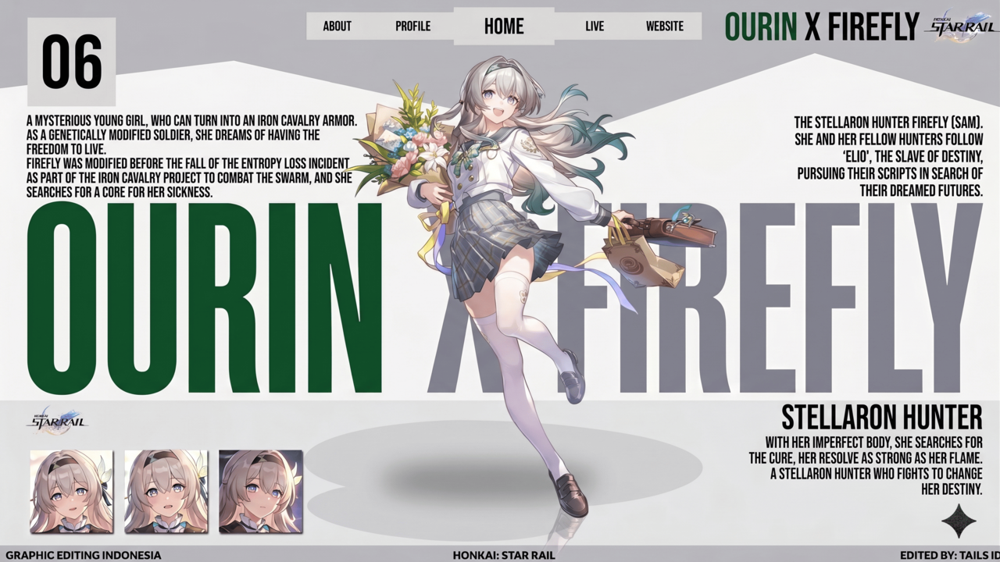
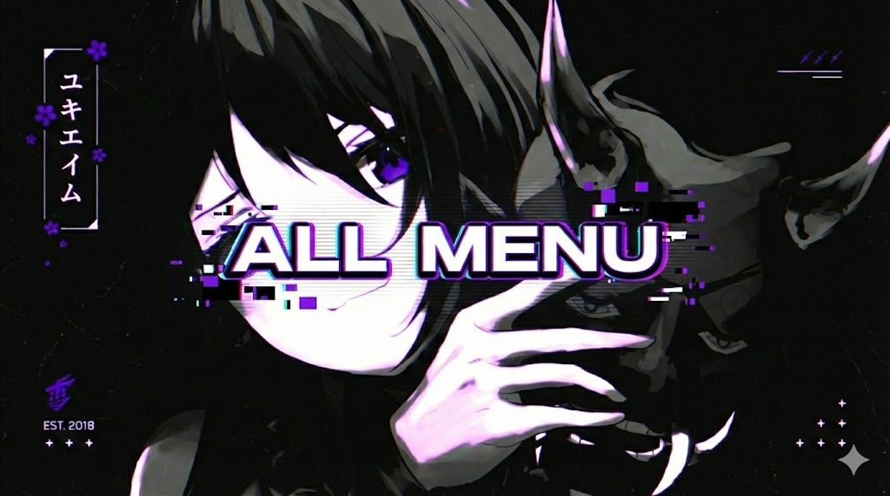
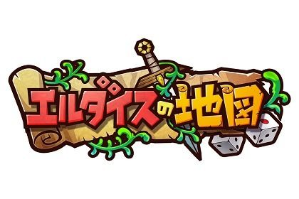

<p align="center">
  
</p>

<h1 align="center">🤖 OURIN AI</h1>

<p align="center">
  <strong>WhatsApp Bot Multi-Device — Fitur Lengkap, Cepat, dan Mudah Digunakan</strong>
</p>

<p align="center">
  
  
  
  
</p>

---

## 📋 Daftar Isi

- [Tentang](#-tentang)
- [Fitur](#-fitur)
- [Screenshot](#-screenshot)
- [Instalasi](#-instalasi)
- [Konfigurasi](#-konfigurasi)
- [Menjalankan Bot](#-menjalankan-bot)
- [Plugin](#-plugin)
- [API Keys](#-api-keys)
- [Lisensi](#-lisensi)

---

## 🧠 Tentang

**OURIN AI** adalah bot WhatsApp multi-device berbasis Node.js dengan berbagai fitur lengkap mulai dari downloader, game, RPG, AI chat, tools, stiker, group management, dan masih banyak lagi. Bot ini dirancang untuk mudah dikembangkan dengan sistem plugin yang modular.

---

## ✨ Fitur

<details open>
<summary><strong>🎮 Games & RPG</strong></summary>

- 🎲 Game interaktif: TicTacToe, Werewolf, Family100, TekaTeki, dll
- ⚔️ RPG: Adventure, Farming, Hunting, Fishing, Mining, Crafting, Trading
- 🏆 Leaderboard & Leveling system
- 👥 Clan/Guild system
</details>

<details>
<summary><strong>📥 Downloader</strong></summary>

| Platform | Support |
|----------|---------|
| YouTube | MP3 & MP4 |
| TikTok | Video & Audio |
| Instagram | Post & Reels |
| Facebook | Video |
| Twitter/X | Media |
| Spotify | Track |
| MediaFire | File |
| CapCut | Template |
| Dan lainnya… | |
</details>

<details>
<summary><strong>🤖 AI & Chat</strong></summary>

- GPT-4o & GPT-5 integration
- DeepSeek AI
- Claude Haiku
- Google Gemini
- AI Image Generation (Flux Pro, txt2img)
- Text to Cartoon / Anime / Ghibli
- QR Code generator & reader
</details>

<details>
<summary><strong>🛠️ Tools</strong></summary>

- Translate (100+ bahasa)
- Sticker maker & berbagai varian (brat, qc, emojimix)
- OCR image to text
- Base64 encode/decode
- Hash generator (MD5, SHA1, SHA256, SHA512)
- Password generator
- JSON beautifier
- Domain WHOIS checker
- Crypto price checker
- Weather info
- Wikipedia search
- Shortlink & QR
- Dan masih banyak lagi…
</details>

<details>
<summary><strong>👥 Group Management</strong></summary>

- Anti-link, anti-toxic, anti-bot
- Welcome & goodbye messages (customizable)
- Auto moderator
- Polling & voting
- Warn system
- Group announcements
- Absensi
</details>

<details>
<summary><strong>⚙️ Owner Features</strong></summary>

- Panel control (Pterodactyl, Linode, DigitalOcean)
- Broadcast (chat & group)
- Add/remove premium users
- System backup
- Plugin management (add/remove/enable/disable)
- Exec & Shell commands
- VPS management
</details>

---

## 📸 Screenshot

<p align="center">
  
  
  
</p>

<p align="center">
  
  
  
</p>

---

## 🚀 Instalasi

### Prasyarat

- **Node.js** >= 16.0.0 (direkomendasikan v22.22.3)
- **npm** >= 10
- **Git**
- **FFmpeg** (untuk fitur audio/video)
- **libwebp** (untuk stiker)

### Langkah Instalasi

```bash
# 1. Clone repository
git clone https://github.com/bradarwhatisdis/ourin-md.git
cd ourin-md

# 2. Install dependencies
npm install

# 3. Edit konfigurasi
nano config.js
```

---

## ⚙️ Konfigurasi

Edit `config.js` dan sesuaikan:

```javascript
// Nomor WhatsApp owner (format 628xxx, tanpa + atau 0)
owner: {
  name: "Nama Kamu",
  number: ["628xxxxxxxxx"]
},

// Nomor WhatsApp bot untuk pairing
session: {
  pairingNumber: "628xxxxxxxxx",
  usePairingCode: true
},

// API Key (daftar di masing-masing penyedia)
APIkey: {
  lolhuman: "your-api-key",
  neoxr: "your-api-key",
  // ... lainnya
}
```

> **Catatan:** Jangan commit `config.js` jika berisi API key atau data sensitif. Repo ini sudah memiliki `.gitignore` untuk `session/`, `data/`, `database/`, `storage/`, dan `temp/`.

---

## ▶️ Menjalankan Bot

```bash
# Mode development
npm start

# Atau langsung
node index.js
```

Bot akan meminta **Pairing Code** atau menampilkan **QR Code** untuk di-scan.

---

## 🔌 Plugin

Bot menggunakan sistem plugin modular. Setiap plugin adalah file `.js` di folder `plugins/`:

```
plugins/
├── ai/          — AI & image generation
├── anime/       — Anime-related
├── canvas/      — Image manipulation
├── download/    — Media downloader
├── game/        — Games
├── group/       — Group management
├── owner/       — Owner-only features
├── rpg/         — RPG game system
├── search/      — Search engines
├── sticker/     — Sticker maker
├── tools/       — Utility tools
└── …
```

### Membuat Plugin Baru

```javascript
const pluginConfig = {
    name: 'contoh',
    alias: ['cth'],
    category: 'general',
    description: 'Plugin contoh',
    usage: '.contoh',
    isOwner: false,
    isPremium: false,
    cooldown: 3,
    energi: 1,
    isEnabled: true
}

async function handler(m, { sock }) {
    await m.reply('Halo! Ini plugin contoh.')
}

export { pluginConfig as config, handler }
```

---

## 🔑 API Keys

Beberapa fitur mungkin membutuhkan API key eksternal. Daftar di penyedia berikut:

| Penyedia | URL | Fitur |
|----------|-----|-------|
| LolHuman | https://api.lolhuman.xyz | Berbagai fitur |
| NeoXR | https://api.neoxr.eu | Tools & media |
| Google AI Studio | https://aistudio.google.com | Gemini AI |
| Groq | https://console.groq.com | AI transkrip |
| Covenant | https://covenant.sbs | API tambahan |

---

## 📄 Lisensi

Proyek ini dilisensikan di bawah **MIT License** — lihat file [LICENSE](LICENSE) untuk detail.

---

<p align="center">
  <strong>OURIN AI</strong> — Made with ❤️ by Dapidzz<br>
  <sub>Powered by Baileys & Node.js</sub>
</p>
